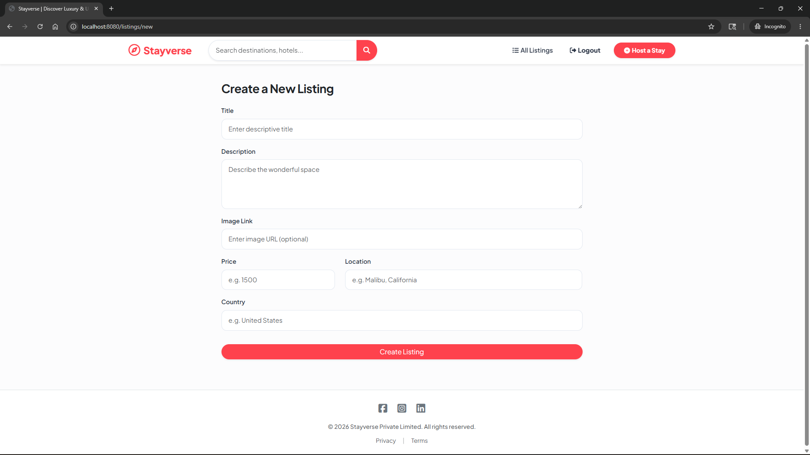
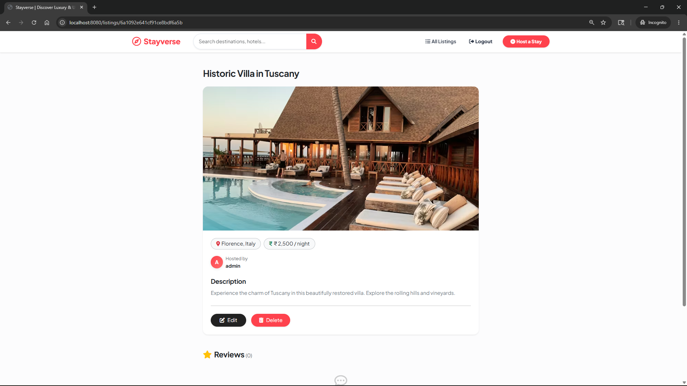
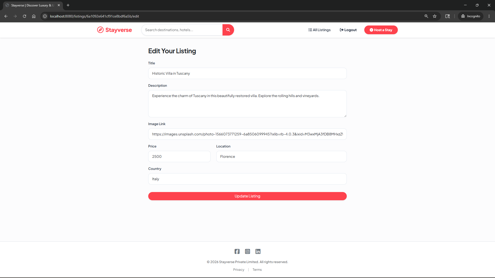
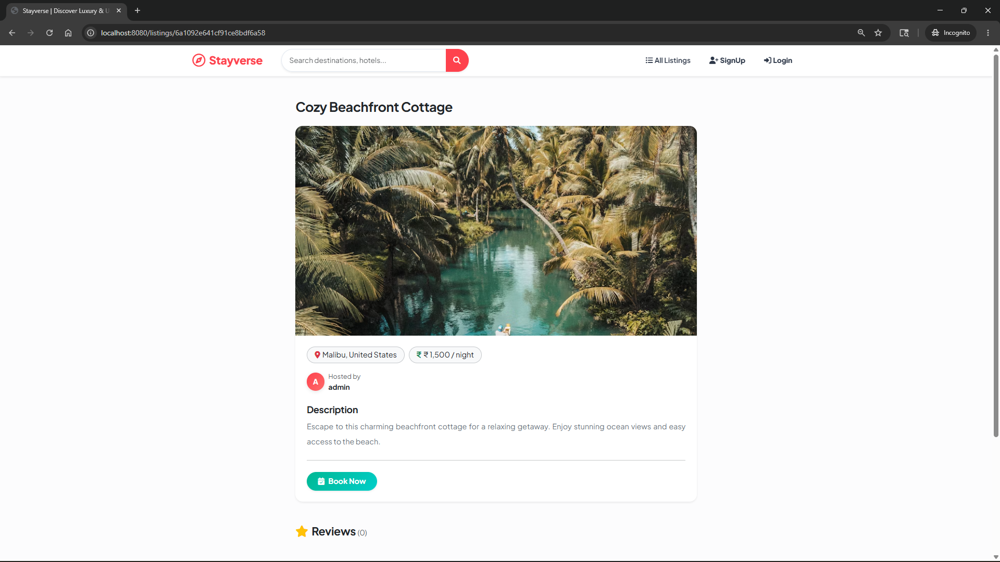
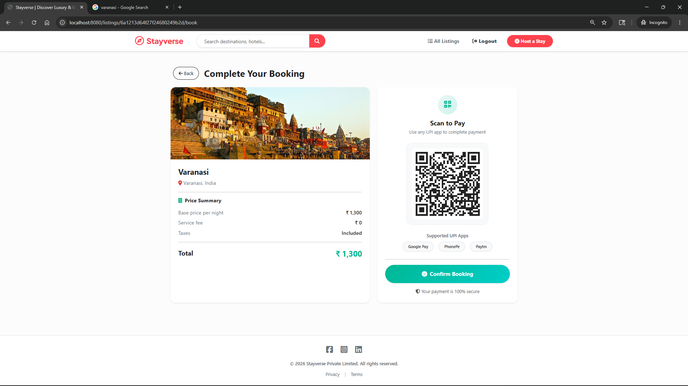

# Stayverse 🌍🏡

**Stayverse** is a full-stack web application designed for discovering, booking, and hosting luxury stays, cozy cottages, and beachfront properties around the world. Whether you are looking for a weekend getaway or want to host your own beautiful space, Stayverse provides a seamless and visually appealing platform to do so.

---

## 🌟 Features

- **User Authentication:** Secure Signup, Login, and Logout functionality with Passport.js.
- **CRUD Operations:** Users can Create, Read, Update, and Delete their own listings.
- **Interactive Maps:** Integrated with Mapbox to display exact locations of properties.
- **Image Uploads:** Seamlessly upload and manage property images via Cloudinary.
- **Reviews & Ratings:** Users can leave reviews and rate the stays they have visited.
- **Responsive Design:** A beautiful, modern, and fully responsive user interface built for all devices.

---

## 📸 Screenshots







---

## 🛠️ Tech Stack

- **Frontend:** HTML5, CSS3, EJS (Embedded JavaScript templates), Bootstrap
- **Backend:** Node.js, Express.js
- **Database:** MongoDB Atlas, Mongoose
- **Authentication:** Passport.js (Local Strategy)
- **APIs/Services:** Mapbox (Geocoding), Cloudinary (Cloud Image Storage)

---

## 🚀 Run Locally

1. **Clone the repository:**
   ```bash
   git clone https://github.com/iamsatwik-dev/Stayverse.git
   cd Stayverse
   ```

2. **Install dependencies:**
   ```bash
   npm install
   ```

3. **Set up Environment Variables:**
   Create a `.env` file in the root directory and add the following keys:
   ```env
   CLOUD_NAME=your_cloudinary_cloud_name
   CLOUD_API_KEY=your_cloudinary_api_key
   CLOUD_API_SECRET=your_cloudinary_api_secret
   MAP_TOKEN=your_mapbox_public_token
   SECRET=your_session_secret
   ATLASDB_URL=your_mongodb_atlas_connection_string
   ```

4. **Run the application:**
   ```bash
   node app.js
   ```

5. **Open in Browser:**
   Visit `http://localhost:8080` in your web browser.

---
*Created by [Satwik](https://github.com/iamsatwik-dev).*
